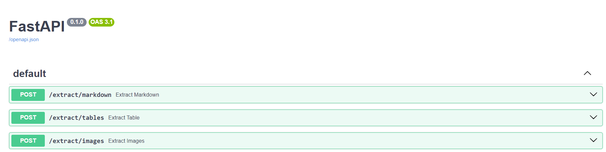
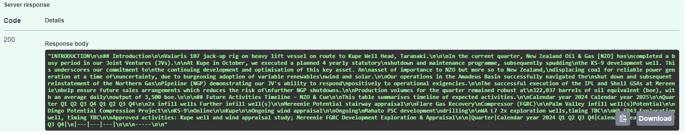
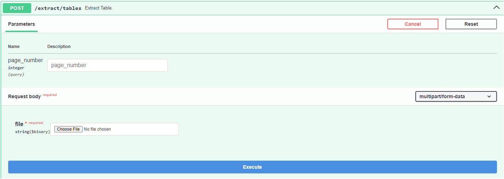
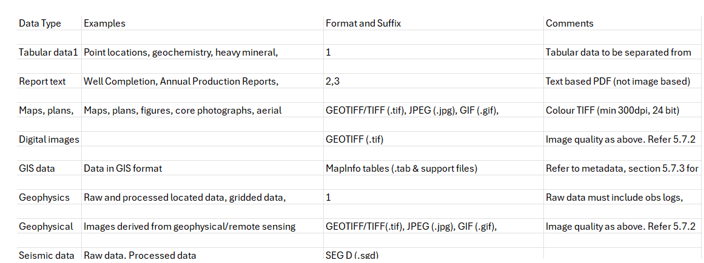
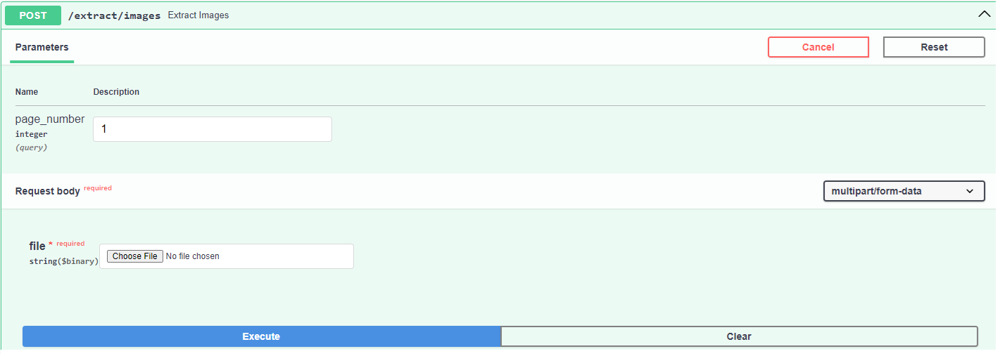
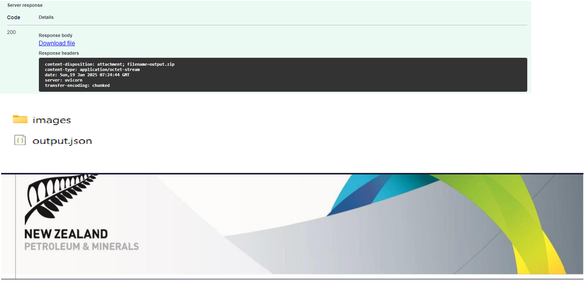

# MIVAA PDF Extractor 
## Introduction

Working with PDFs can be challenging, especially when dealing with documents containing tables, images, and metadata. This is particularly important for those in the AI field who are fine-tuning large language models (LLMs) or developing knowledge retrieval systems like RAG (Retrieval-Augmented Generation). Extracting accurate data is essential in these scenarios.

This solution contains a generic REST based API for extracting text, images, tables, and metadata data from PDF documents.


## Installation

This application is build in python using fastAPI and PyMuPDF4LLM

##### Install dependency:
```
    pip install -r requirements.txt
```

## Run application

Run the following command:
```
    uvicorn main:app --host 0.0.0.0 --port 8000
```

Lauch swagger APIs:
```
    http://localhost:8000/docs
```


## How to use APIs


#### Extract Markdown

If you have a PDF and simply want the content in a clean format that is compatible with Markdown
###### Input:


###### Response:



#### Extract Tables

Extracting tables from PDFs while preserving their formatting can be a challenging task. However, this API gracefully handles this process, ensuring that tables are extracted cleanly and returned as a CSV file.

###### Input:


###### Response:



#### Extract Images

The extraction of images along with text is often overlooked but incredibly significant, particularly for documents that contain figures, diagrams, or charts. Fortunately, this API seamlessly handles this process, ensuring that both images and text are extracted accurately.

###### Input:


###### Response:



